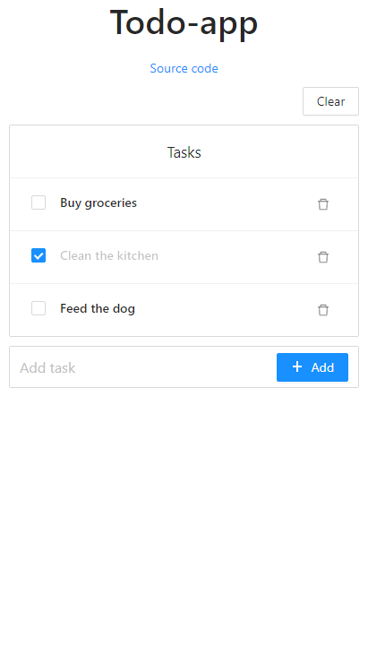

# Todo-app made with React



How to run locally:  
```
git clone https://github.com/mkauha/todo-react.git
cd todo-react
npm install
npm start
```

Features:
- Add/Remove tasks
- Marks tasks as done
- Save data to local storage

Development ideas:
- Add time/date to task
- Add colors/icons to tasks
- Backend (saving tasks to db)
- Task collections

Libraries/frameworks:  
React - https://reactjs.org/  
Create React App - https://create-react-app.dev/  
Node - https://nodejs.org/en/  
Ant Design - https://ant.design/  
Lodash - https://lodash.com/  

